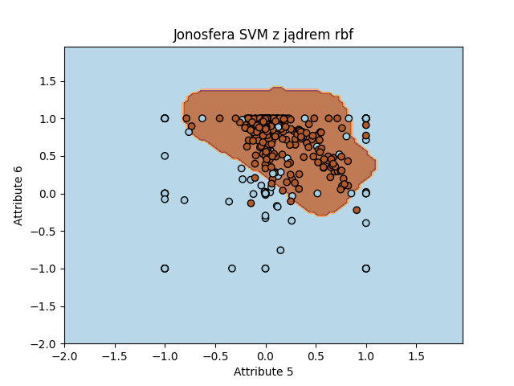
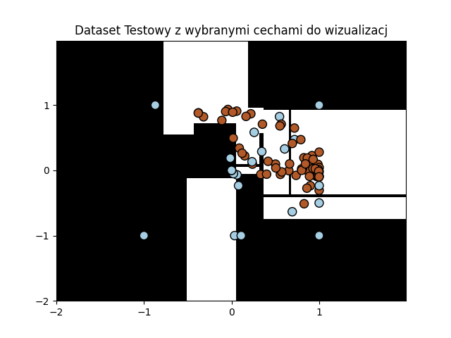
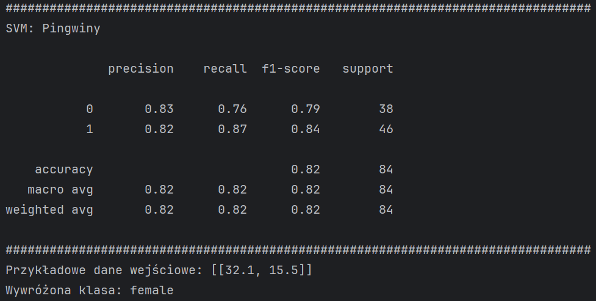
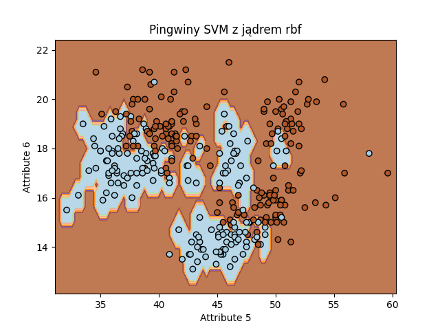
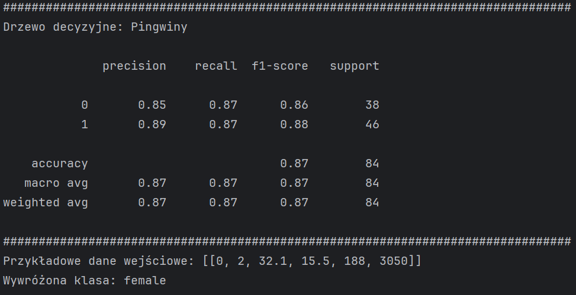
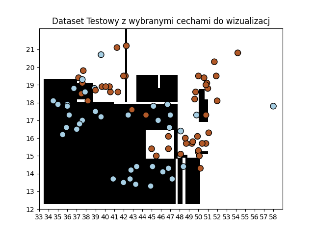

# Zadania na NAI (24/25)

- lab1. Gra Reversi napisana w Pyhonie z użyciem EasyAI
- lab2. Uproszczona Gra MoonLander napisana w Pyhonie z użyciem scikit-fuzzy i Pygame
- lab3. Rekomendator filmów dla użytkowników z użyciem Kmeans w Javie
- lab4. Kategoryzacja danych za pomocą Maszyny Vektorów nośnych i Drzewa decyzyjnego

## Klasyfikacja sygnałów w jonosferze
### IonosphereDataset za pomocą SVM

### IonosphereDataset za pomocą drzewa decyzyjnego

## Klasyfikacji płci pingwinów
### PenguinsDataset za SVM

### PenguinsDataset za pomocą drzewa decyzyjnego

