# Zadania na NAI (24/25)

- lab1. Gra Reversi napisana w Pyhonie z użyciem EasyAI
- lab2. Uproszczona Gra MoonLander napisana w Pyhonie z użyciem scikit-fuzzy i Pygame
- lab3. Rekomendator filmów dla użytkowników z użyciem Kmeans w Javie
- lab4. Kategoryzacja danych za pomocą Maszyny Vektorów nośnych i Drzewa decyzyjnego
- lab5. Klasyfikacja danych za pomocą Sieci Neuronowych
- lab6. Zła platform do wyświetlania reklam 

# Podsumowanie ostatniego lab
## Porównanie Klasyfikacji Jonosfery + confusion matrix dla sieci neuronowej
Wyniki nie różnią się aż tak mocno między sobą w przypadku danych z Jonosfery. Kazdy klasyfikator dobrze przewidział klasę. 
"1" i "good" to ta sama klasa. W przypadku sieci neuronowych zacząłem mądrzej nazywać klasy.
### SVM
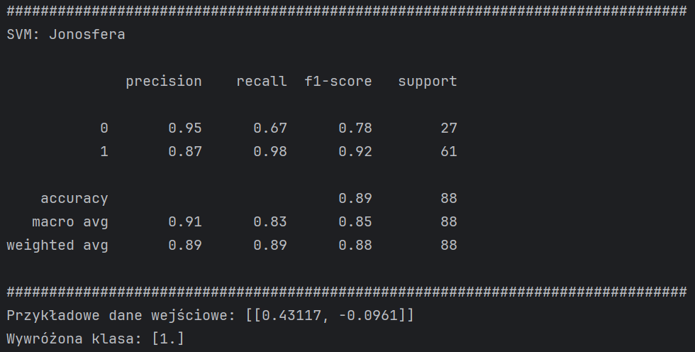
### Drzewo decyzyjne
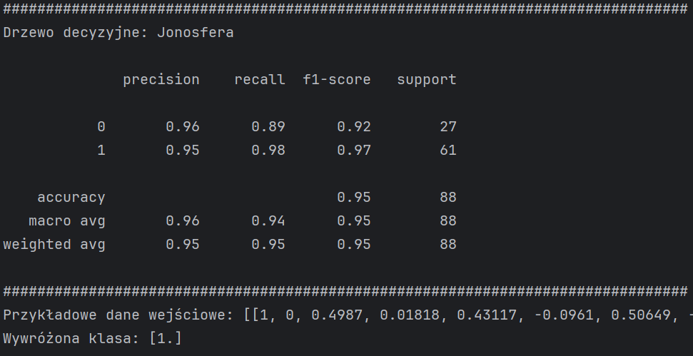
### Sieć nieuronowa
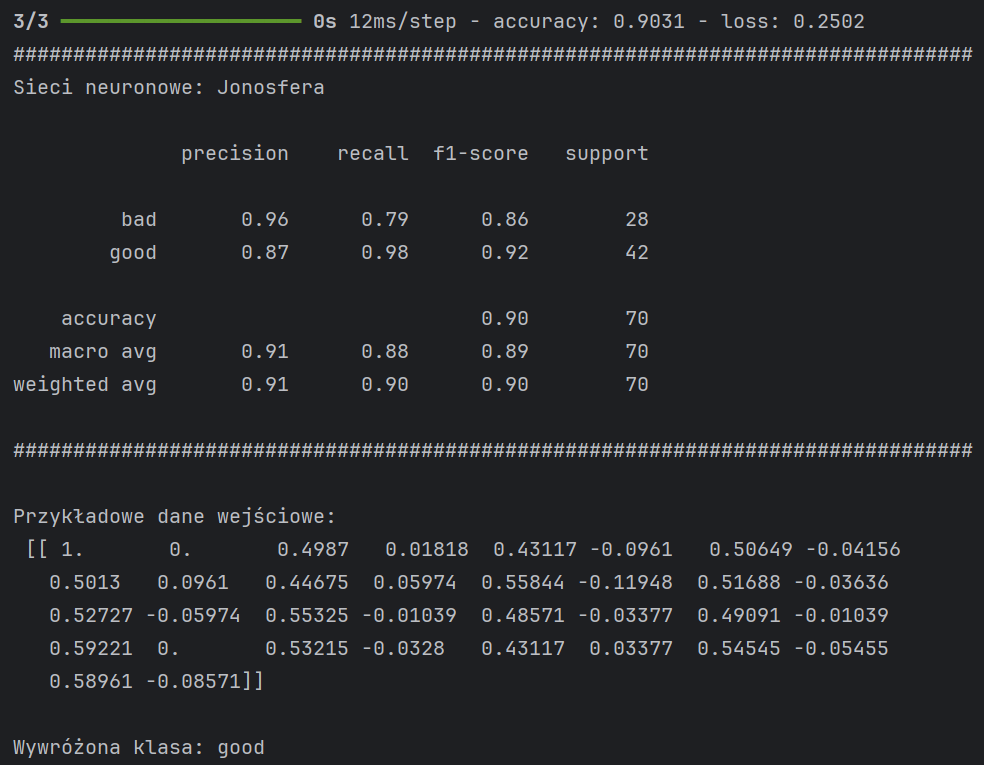
### Confusion matrix
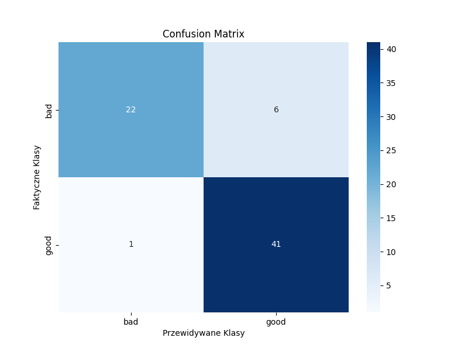

## Klasyfikacja CIFAR-10
### Przykładowy obraz użyty do przewidywania klasy
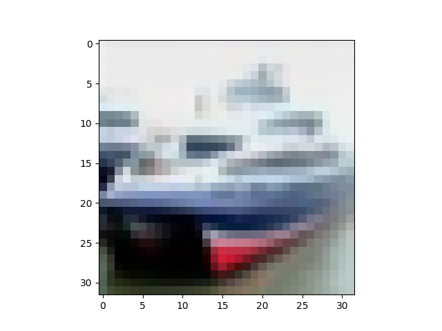

### Sieć neuronowa 1
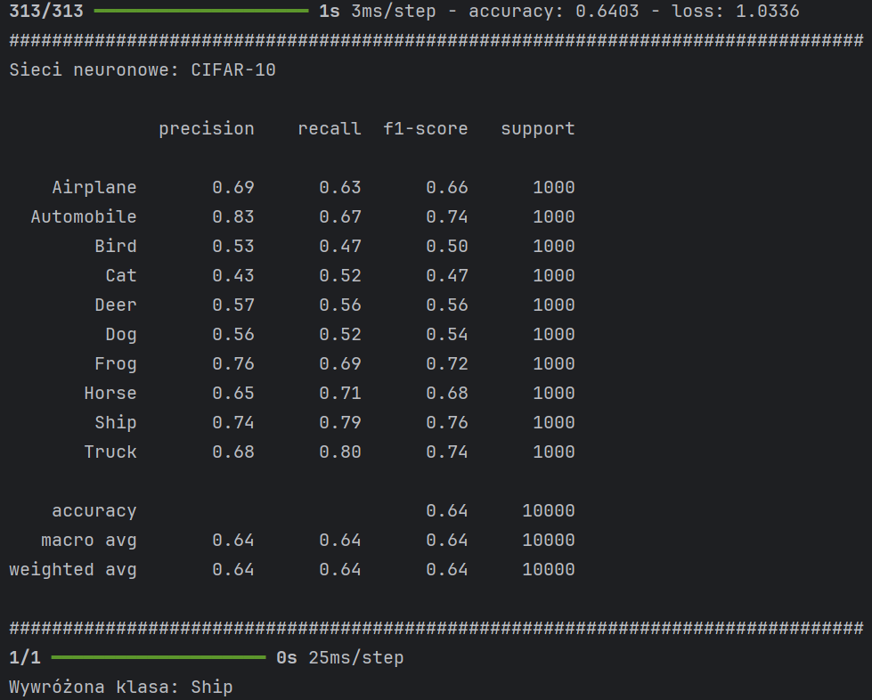

### Sieć neuronowa 2
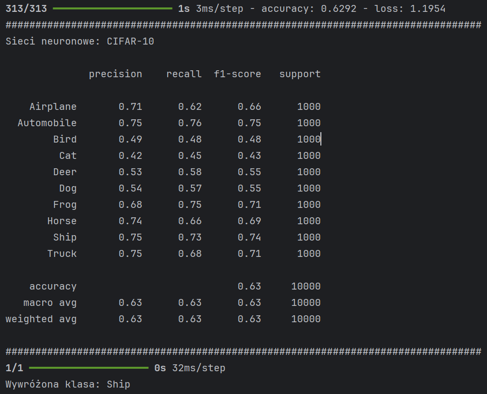

## Klasyfikacja fashion MINST
### Przykładowy obraz użyty do przewidywania klasy
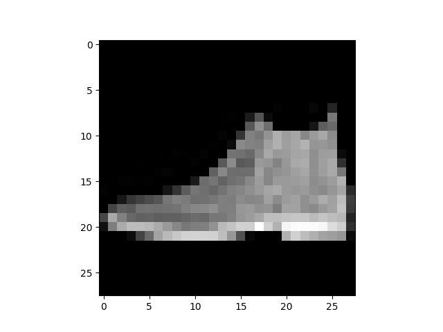

### Sieć neuronowa
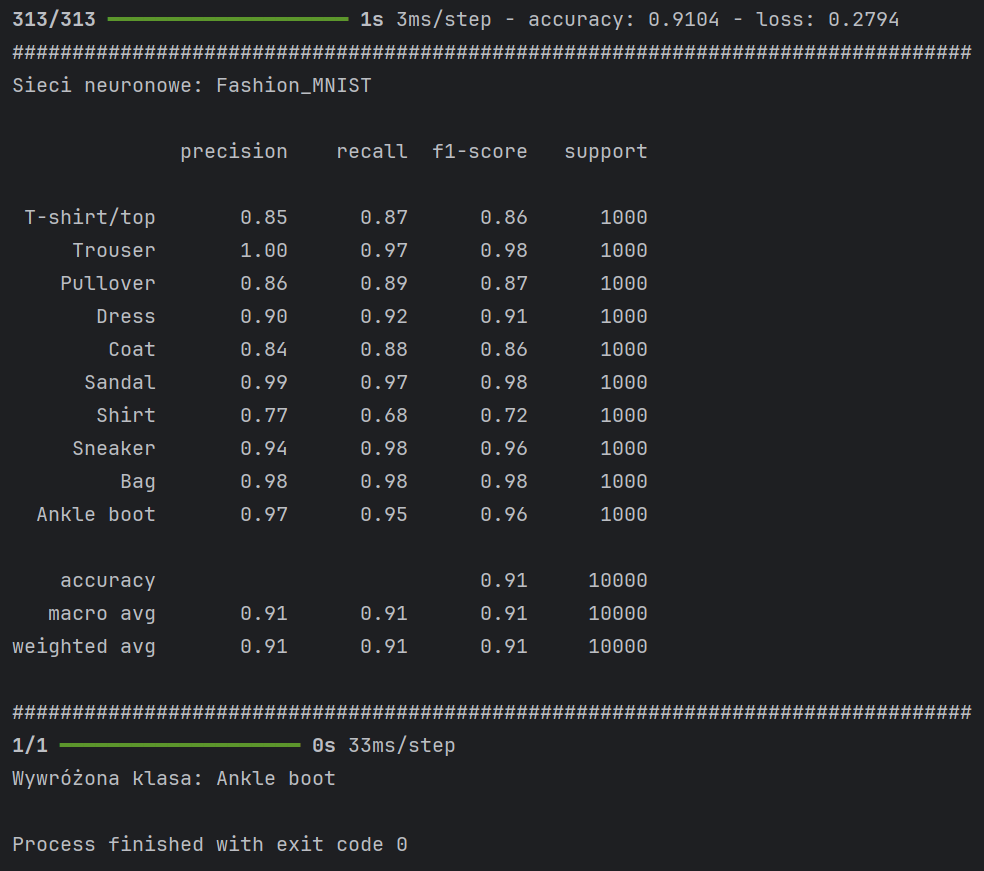

## Propozycja użycia sieci neuronowej:
Można by stworzyć sieć neuronową wytrenowaną do klasyfikacji kawy w 100-punktowej skali SCA. Wymagałoby to posiadania zbioru danych zawierającego poniższe parametry, 
które są określane przez specjalnie wykwalifikowane osoby (tzw. Q-Graderów). Dodatkowo, dataset powinien być uzupełniony o parametry kawy mierzone obiektywnie. 
Ostatnim elementem naszego zestawu danych byłyby zdjęcia ziaren kawy po wypaleniu. Od tak wyuczonego modelu oczekiwano by, że na podstawie przekazanego zdjęcia kawy oceni,
ile punktów może ona uzyskać w skali SCA, a co za tym idzie, określi jej jakość. Można by go też wytrenowac w taki sposób żeby na podstawie parametrów fizycznych kawy szacował jaką ocena może uzyskać kawa w skali SCA. 
W tym wypadku dataset powinien posiadać wspomniane powyżej parametry fizyczne kawy oraz jej ocenę w skali SCA.  
  
## Skala SCA
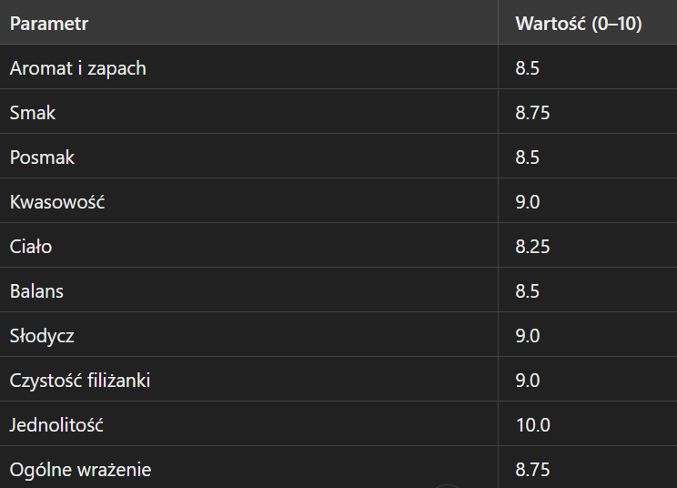
## Parametry fizyczne kawy
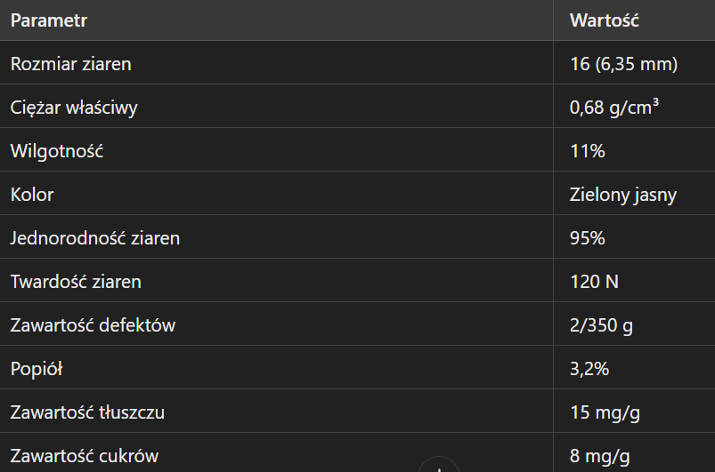