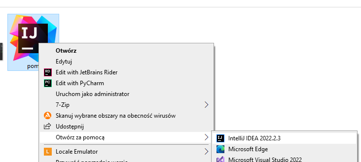
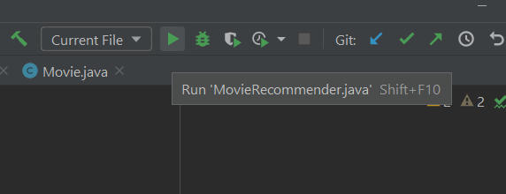
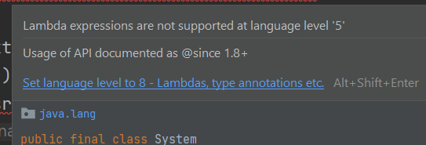

- Program uruchamiany w programie InteliJ. Wybieramy plik "pom" i otwieramy za pomocą InteliJ
- Główna metoda uruchamiająca znajduje się w Klasie "Movie Recommender" i to z niej należy uruchamiać program
- Jeśli będzie krzyczeć o wersję javy to wystarczy najechać na podkreślenie błędu i kliknąć "Set level language to ..." by ustawiło odpowiednią wersję.

