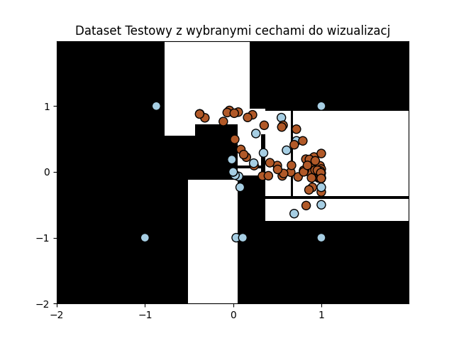

## Klasyfikacja sygnałów w jonosferze
### IonosphereDataset za pomocą SVM

### IonosphereDataset za pomocą drzewa decyzyjnego

## Klasyfikacji płci pingwinów
### PenguinsDataset za pomocą SVM

### PenguinsDataset za pomocą drzewa decyzyjnego

