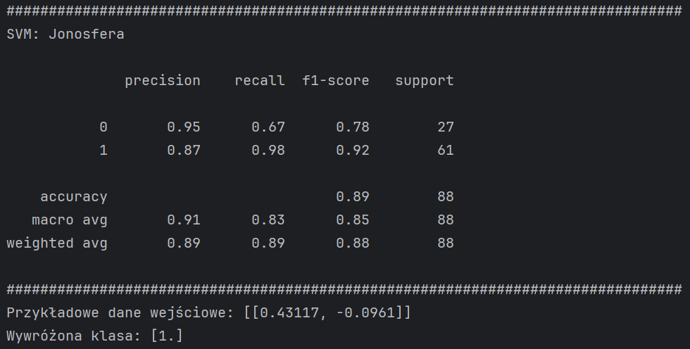
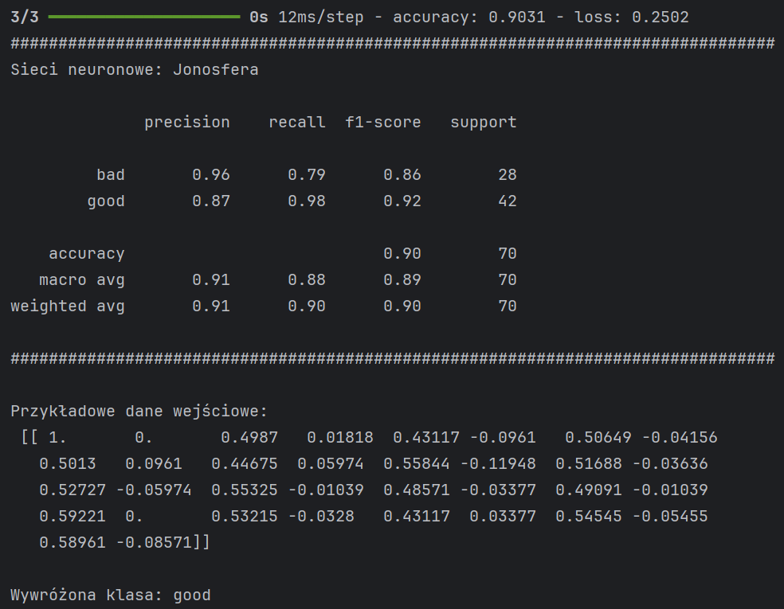
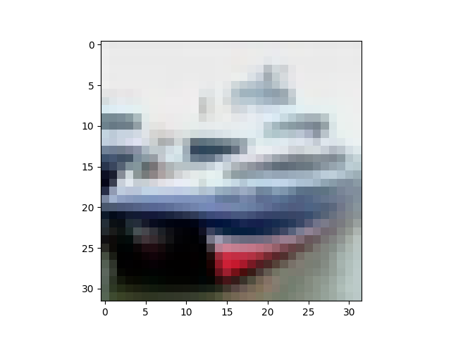
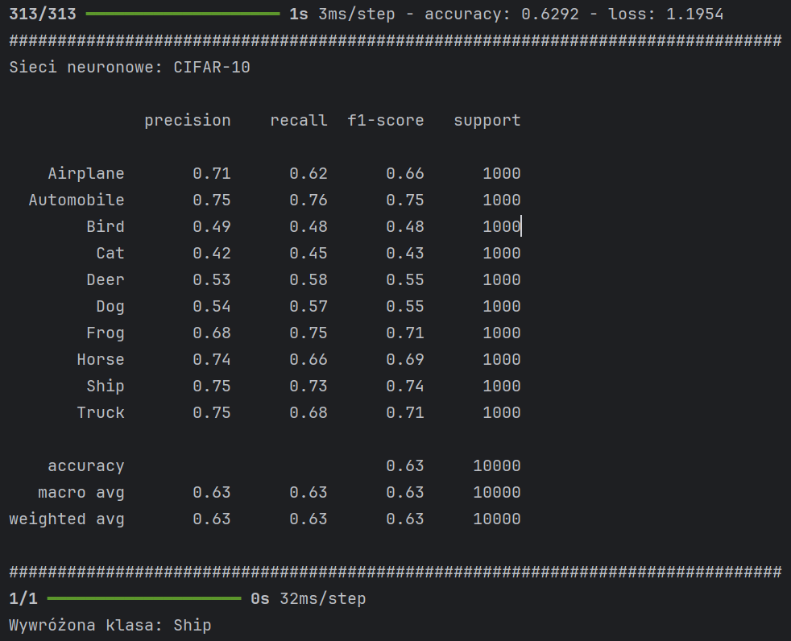

## Porównanie Klasyfikacji Jonosfery + confusion matrix dla sieci neuronowej
Wyniki nie różnią się aż tak mocno między sobą w przypadku danych z Jonosfery. Kazdy klasyfikator dobrze przewidział klasę. 
"1" i "good" to ta sama klasa. W przypadku sieci neuronowych zacząłem mądrzej nazywać klasy.
### SVM

### Drzewo decyzyjne

### Sieć nieuronowa

### Confusion matrix

## Klasyfikacja CIFAR-10
### Przykładowy obraz użyty do przewidywania klasy

### Sieć neuronowa 1

### Sieć neuronowa 2

## Klasyfikacja fashion MINST
### Przykładowy obraz użyty do przewidywania klasy

### Sieć neuronowa
